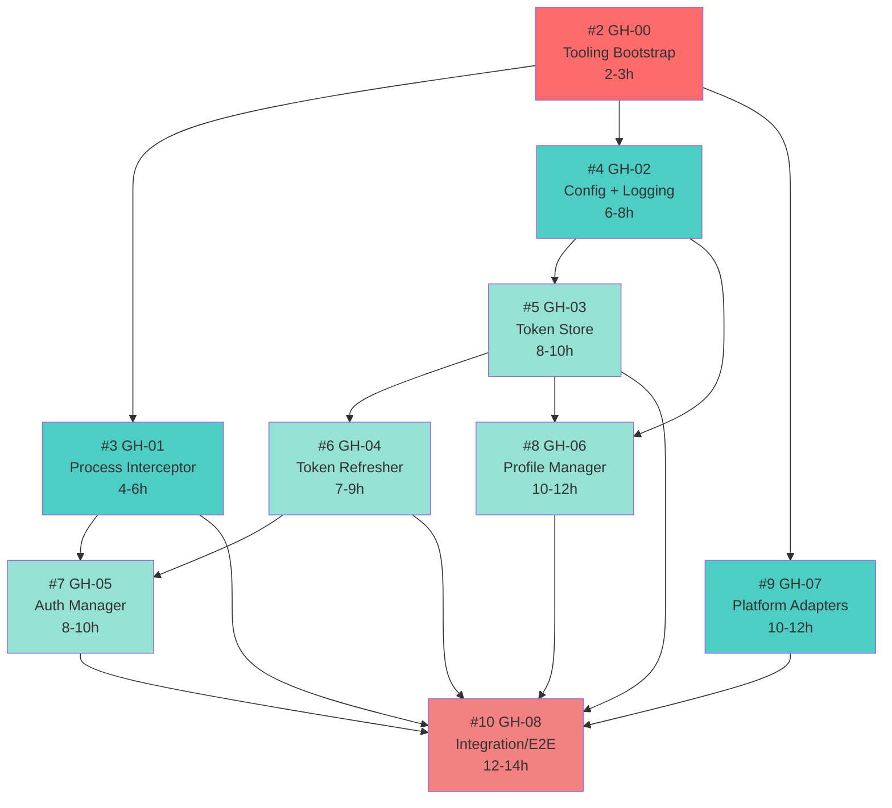

# GitHub Issues Summary - Claude CLI Wrapper Project

## Overview
All GitHub issues have been successfully created with deep TDD workflows, atomic commit strategies, and comprehensive dependency tracking.

## Created Issues

| Issue | Title | Status | Dependencies | Effort | Priority |
|-------|-------|--------|--------------|--------|----------|
| [#1](https://github.com/Jackson-Devices/cc-profile-hub/issues/1) | Improve Project Documentation Structure and Developer Onboarding | Open | None | 16-24h | High |
| [#2](https://github.com/Jackson-Devices/cc-profile-hub/issues/2) | GH-00: Tooling Bootstrap & CI Setup | Open | None | 2-3h | Critical |
| [#3](https://github.com/Jackson-Devices/cc-profile-hub/issues/3) | GH-01: Process Interceptor Shell | Open | #2 | 4-6h | High |
| [#4](https://github.com/Jackson-Devices/cc-profile-hub/issues/4) | GH-02: Config Loader + Logging | Open | #2 | 6-8h | High |
| [#5](https://github.com/Jackson-Devices/cc-profile-hub/issues/5) | GH-03: Token Store + Crypto Layer | Open | #2, #4 | 8-10h | High |
| [#6](https://github.com/Jackson-Devices/cc-profile-hub/issues/6) | GH-04: Token Refresher + Retry Policy | Open | #2, #5 | 7-9h | High |
| [#7](https://github.com/Jackson-Devices/cc-profile-hub/issues/7) | GH-05: Auth Manager + Scheduler | Open | #3, #6 | 8-10h | High |
| [#8](https://github.com/Jackson-Devices/cc-profile-hub/issues/8) | GH-06: Profile Manager + CLI Commands | Open | #4, #5 | 10-12h | Medium |
| [#9](https://github.com/Jackson-Devices/cc-profile-hub/issues/9) | GH-07: Platform Adapters (Windows/macOS/Linux/WSL) | Open | #2 | 10-12h | High |
| [#10](https://github.com/Jackson-Devices/cc-profile-hub/issues/10) | GH-08: Integration/E2E Harness & Documentation | Open | #3-#9 | 12-14h | Medium |

## Dependency Graph



**Legend**:
- 🔴 Red (#2): Foundation - Must complete first
- 🟢 Cyan (#3,#4,#9): Can run in parallel after foundation
- 🟡 Light Green (#5,#6,#7,#8): Depends on cyan layer
- 🔴 Pink (#10): Final integration - needs everything

## Parallel Work Opportunities

### Wave 1: Foundation (Week 1)
**Start Immediately**:
- #2 (GH-00) - Tooling Bootstrap ← **BLOCKER, START FIRST**

**Estimated**: 2-3 hours for 1 developer

### Wave 2: Core Components (Week 1-2)
**After #2 completes, start in parallel**:
- #3 (GH-01) - Process Interceptor (4-6h)
- #4 (GH-02) - Config + Logging (6-8h)
- #9 (GH-07) - Platform Adapters (10-12h)

**Team**: 3 developers can work simultaneously
**Estimated**: 10-12 hours if parallel (longest task: GH-07)

### Wave 3: Authentication Layer (Week 2-3)
**After #4 (GH-02) completes**:
- #5 (GH-03) - Token Store (8-10h) ← **Must complete before GH-04**

**After #5 (GH-03) completes**:
- #6 (GH-04) - Token Refresher (7-9h)

**After #3 (GH-01) and #6 (GH-04) complete**:
- #7 (GH-05) - Auth Manager (8-10h)

**In parallel with above**:
- #8 (GH-06) - Profile Manager (10-12h) ← Needs #4 and #5

**Team**: 2-3 developers can work simultaneously
**Estimated**: 18-22 hours if sequential, 10-12h if parallel

### Wave 4: Integration (Week 3-4)
**After everything else completes**:
- #10 (GH-08) - Integration/E2E (12-14h)

**Team**: 1 developer
**Estimated**: 12-14 hours

## Timeline Estimates

### Optimistic (3 developers, maximum parallelism)
- **Week 1**: GH-00 → GH-01, GH-02, GH-07 (parallel)
- **Week 2**: GH-03 → GH-04, GH-05, GH-06 (parallel)
- **Week 3**: GH-08 (integration)
- **Total**: ~3 weeks

### Realistic (2 developers, moderate parallelism)
- **Week 1**: GH-00 → GH-01, GH-02 (parallel)
- **Week 2**: GH-07, GH-03 (parallel)
- **Week 3**: GH-04, GH-05 (sequential)
- **Week 4**: GH-06 (solo)
- **Week 5**: GH-08 (integration)
- **Total**: ~5 weeks

### Conservative (1 developer, sequential)
- **Week 1**: GH-00, GH-01
- **Week 2**: GH-02, GH-03
- **Week 3**: GH-04, GH-05
- **Week 4**: GH-06
- **Week 5**: GH-07
- **Week 6-7**: GH-08
- **Total**: ~7 weeks

## TDD Compliance

Every issue follows strict TDD:

### RED-GREEN-REFACTOR Cycle
1. **RED**: Write failing test first
2. **GREEN**: Write minimal code to pass
3. **REFACTOR**: Improve code while keeping tests green
4. **COMMIT**: Atomic commit with conventional message

### Commit Message Format
```
type(scope): description

Example: test(gh-03): add token encryption test
Example: feat(gh-03): implement AES-256-GCM encryption
Example: refactor(gh-03): extract crypto utilities
```

**Types**: `test`, `feat`, `fix`, `refactor`, `docs`, `chore`

### Commit Frequency
- **8-14 commits per issue**
- Each commit does ONE thing
- All tests pass after each commit
- No "WIP" commits

## Quality Gates

### Per-Issue Requirements
- [ ] All tests pass (100% pass rate)
- [ ] Code coverage >= 90%
- [ ] ESLint passes (0 errors, 0 warnings)
- [ ] Prettier formatted
- [ ] TypeScript strict mode passes
- [ ] CI passes on all platforms (Ubuntu, Windows, macOS)

### Code Review Checklist
- [ ] TDD workflow followed (tests before implementation)
- [ ] Atomic commits with clear messages
- [ ] No `any` types used
- [ ] All functions have return type annotations
- [ ] Error handling implemented
- [ ] Documentation updated (JSDoc, README)

## Success Criteria

### MVP Complete When:
1. **All issues closed** (#2 through #10)
2. **CI pipeline green** on all platforms
3. **Coverage >= 90%** overall
4. **E2E tests pass** (GH-08)
5. **Documentation complete** (README, API docs, architecture diagrams)

### Integration Test Scenarios (GH-08)
- ✅ Fresh install → login → execute command
- ✅ Token refresh before expiry (< 5 min threshold)
- ✅ Background refresh during long session
- ✅ Profile switch without re-auth
- ✅ Multi-account usage
- ✅ Network failure recovery
- ✅ Invalid token handling

## External Dependencies

### Runtime Dependencies
- **Node.js**: 20.x LTS (required)
- **npm**: 10.x or pnpm 9.x
- **Claude CLI**: Official Anthropic CLI (must be installed)

### Development Dependencies
- TypeScript 5.3+
- Jest 29.x
- ESLint + TypeScript rules
- Prettier

### Platform-Specific (Optional)
- **Windows**: Windows Credential Manager (native)
- **macOS**: Keychain (native)
- **Linux**: libsecret / GNOME Keyring
- **WSL**: Windows Credential Manager bridge

### External Services
- **OAuth**: Anthropic console API
  - Endpoint: `https://console.anthropic.com/v1/oauth/token`
  - Client ID: `9d1c250a-e61b-44d9-88ed-5944d1962f5e`

## Quick Start for Contributors

### 1. Pick an Issue
Check the dependency graph and pick an issue where all upstream dependencies are complete.

### 2. Follow TDD Workflow
Each issue has 8-14 atomic commits documented:
- Read commit descriptions
- Write test first (RED)
- Implement minimal code (GREEN)
- Refactor if needed
- Commit atomically

### 3. Branch Naming
```bash
# Feature branches
git checkout -b feat/XX-description

# Chore branches
git checkout -b chore/XX-description

# Fix branches
git checkout -b fix/XX-description
```

Examples:
- `chore/00-bootstrap`
- `feat/01-interceptor`
- `feat/02-config-logging`

### 4. Pull Request
```bash
# Push branch
git push -u origin feat/XX-description

# Create PR
gh pr create --title "feat(gh-XX): description" \
  --body "Closes #issue-number\n\nDepends on #upstream-issues" \
  --base main
```

## Monitoring Progress

### GitHub Project Board (Recommended)
Create a project board with columns:
- **Backlog**: All issues
- **Ready**: Dependencies met
- **In Progress**: Actively being worked
- **In Review**: PR created
- **Done**: Merged

### CI/CD Dashboard
Monitor: https://github.com/Jackson-Devices/cc-profile-hub/actions

### Coverage Reports
After CI runs, check Codecov integration for coverage trends.

## Next Steps

1. **Assign #2 (GH-00)** to a developer to start immediately
2. **Set up project board** for tracking
3. **Configure Codecov** for coverage reporting
4. **Create milestones**:
   - Milestone 1: Foundation (GH-00, GH-01, GH-02, GH-07)
   - Milestone 2: Auth Layer (GH-03, GH-04, GH-05, GH-06)
   - Milestone 3: Integration (GH-08)
5. **Schedule code reviews** for each PR

---

**Generated**: 2025-11-14
**Total Issues**: 10
**Total Estimated Effort**: 69-85 hours
**MVP Target**: 3-7 weeks depending on team size
