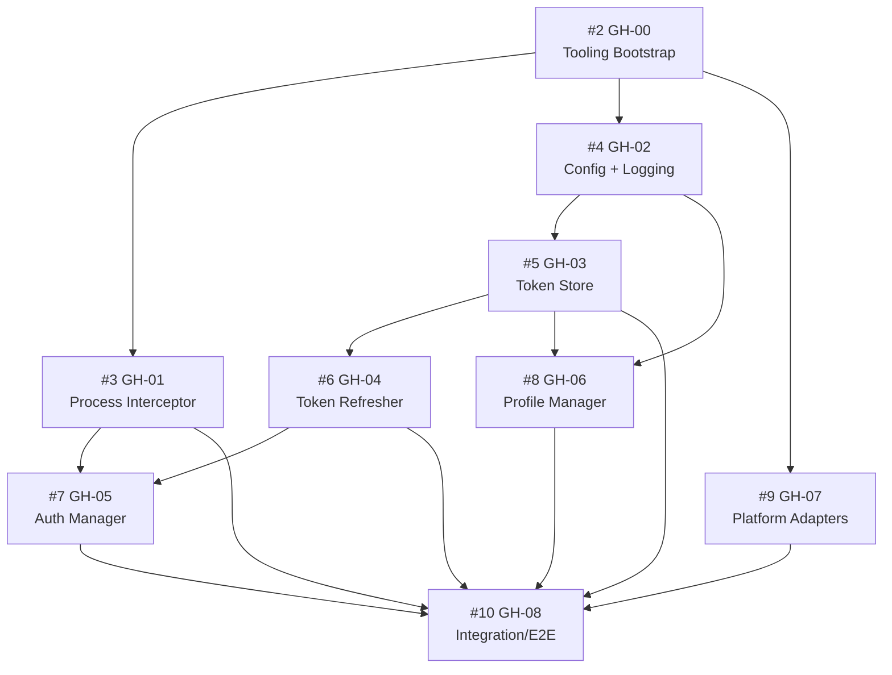

# Claude CLI Profile Hub (cc-profile-hub)

> A transparent authentication proxy/wrapper for Claude CLI that auto-refreshes OAuth tokens and manages multiple accounts seamlessly.

[](https://github.com/Jackson-Devices/cc-profile-hub/actions)
[](https://codecov.io/gh/Jackson-Devices/cc-profile-hub)
[](https://www.typescriptlang.org/)
[](LICENSE)

## 🎯 What is This?

Claude CLI Profile Hub is a transparent wrapper around the official Claude CLI that solves two critical problems:

1. **Auto-Refresh OAuth Tokens**: Never manually re-authenticate when your tokens expire
2. **Multi-Account Management**: Switch between personal/work accounts instantly without re-login

### The Problem

The official Claude CLI uses OAuth authentication with tokens that expire. When working with external tools (IDEs, scripts), token expiration breaks your workflow:

```bash
# Your token expires mid-session
$ claude "Help me debug this code"
Error: Authentication token expired. Please run 'claude auth login'

# You have to stop, re-authenticate, then continue
$ claude auth login
# (Opens browser, login again...)

# Resume work
$ claude "Help me debug this code"  # Finally works
```

**With multiple accounts?** Even worse - you must logout and re-authenticate every time you switch.

### The Solution

Claude CLI Profile Hub sits transparently between your tools and Claude CLI:

```bash
# Install wrapper (wraps official CLI)
$ npm install -g @community/claude-wrapper

# Your tools work seamlessly - tokens refresh automatically
$ claude "Help me debug this code"
✓ Token refreshed (expires in 29 minutes)
[Claude response...]

# Switch accounts instantly
$ claude --wrapper profile switch work
✓ Switched to 'work' profile (user@company.com)

$ claude "Corporate question"
[Uses work account...]

$ claude --wrapper profile switch personal
✓ Switched to 'personal' profile (me@gmail.com)
```

## ✨ Features

- 🔄 **Auto-Refresh**: Tokens refresh 5 minutes before expiry (zero interruption)
- 👥 **Multi-Account**: Manage unlimited profiles (personal, work, clients)
- 🎭 **Transparent**: External tools can't tell it's not the real Claude CLI
- 🖥️ **Cross-Platform**: Works on Windows, macOS, Linux, and WSL
- 🔒 **Secure**: Uses OS credential storage (Keychain, Credential Manager, libsecret)
- ⚡ **Fast**: <100ms overhead per command
- 🧪 **Well-Tested**: 90%+ coverage with comprehensive test suite

## 🚀 Quick Start

### Prerequisites

- Node.js 20.x or higher
- npm 10.x or pnpm 9.x
- Official Claude CLI installed ([anthropics/claude-cli](https://github.com/anthropics/claude-cli))

### Installation

```bash
# Install wrapper globally
npm install -g @community/claude-wrapper

# Wrapper automatically detects and wraps existing Claude CLI
# Your existing 'claude' command now has superpowers!
```

### First Run

```bash
# Check status
$ claude --wrapper auth status
✓ Active profile: default (user@example.com)
✓ Token valid (expires in 28 minutes)
✓ Refresh will occur at: 2025-11-14 14:32:00

# Use Claude normally - wrapper handles auth automatically
$ claude "What is TypeScript?"
[Response from Claude...]

# Add a second account
$ claude --wrapper profile add work
Opening browser for authentication...
✓ Profile 'work' added (user@company.com)

# Switch between accounts
$ claude --wrapper profile switch work
✓ Now using 'work' profile
```

## 📖 Documentation

- **[Getting Started Guide](docs/GETTING_STARTED.md)** - 10-minute setup
- **[Architecture Overview](docs/ARCHITECTURE.md)** - System design and diagrams
- **[API Reference](docs/API_REFERENCE.md)** - Component contracts
- **[Testing Strategy](docs/TESTING_STRATEGY.md)** - TDD approach
- **[Contributing Guide](docs/CONTRIBUTING.md)** - How to contribute
- **[GitHub Issues](GITHUB_ISSUES_SUMMARY.md)** - Development roadmap

### Research & Implementation Guides

- **[Framework Research](FRAMEWORK_RESEARCH.md)** - Deep dive into TypeScript, Jest, OAuth 2.0, cross-platform
- **[Implementation Guide](IMPLEMENTATION_GUIDE.md)** - Step-by-step with code templates
- **[Code Patterns](CODE_PATTERNS.md)** - Best practices and anti-patterns
- **[Research Summary](RESEARCH_SUMMARY.md)** - Quick reference (20 min read)

## 🏗️ Architecture

```
┌─────────────────┐     ┌──────────────────┐     ┌─────────────────┐
│  External Tool  │────▶│  Claude Wrapper  │────▶│   Claude CLI    │
│  (IDE, Script)  │◀────│   (This Project) │◀────│   (Official)    │
└─────────────────┘     └──────────────────┘     └─────────────────┘
                               │
                               ▼
                    ┌──────────────────────┐
                    │   Auth Management    │
                    │  - Token Refresh     │
                    │  - Account Switch    │
                    │  - Profile Storage   │
                    └──────────────────────┘
```

### How It Works

1. **Interception**: Wrapper receives command instead of Claude CLI
2. **Auth Check**: Checks if token expires within 5 minutes
3. **Refresh**: If needed, refreshes token using OAuth refresh flow
4. **Execution**: Spawns real Claude CLI with fresh token
5. **Transparency**: stdio/signals/exit codes passed through seamlessly

## 🛠️ Development

### Project Status

**Current Phase**: Planning & Documentation Complete ✅

See [GITHUB_ISSUES_SUMMARY.md](GITHUB_ISSUES_SUMMARY.md) for detailed roadmap.

### Getting Started (Contributors)

```bash
# Clone repository
git clone https://github.com/Jackson-Devices/cc-profile-hub.git
cd cc-profile-hub

# Install dependencies (after GH-00 is complete)
npm install

# Run tests
npm test

# Watch mode
npm run test:watch

# Build
npm run build

# Lint
npm run lint
```

### Development Workflow (TDD)

This project follows strict Test-Driven Development:

1. **RED**: Write failing test first
2. **GREEN**: Write minimal code to pass
3. **REFACTOR**: Improve code while keeping tests green
4. **COMMIT**: Atomic commit with clear message

See [docs/TESTING_STRATEGY.md](docs/TESTING_STRATEGY.md) for details.

### Issue Dependencies



**Start Here**: [Issue #2 (GH-00): Tooling Bootstrap](https://github.com/Jackson-Devices/cc-profile-hub/issues/2)

## 🎯 Roadmap

### MVP (v1.0) - Core Functionality
- [x] Project planning & documentation
- [x] GitHub issues with TDD workflow
- [ ] Tooling bootstrap & CI (#2)
- [ ] Process interceptor (#3)
- [ ] Config loader & logging (#4)
- [ ] Token store & encryption (#5)
- [ ] Token refresher with retry (#6)
- [ ] Auth manager & scheduler (#7)
- [ ] Profile manager & CLI (#8)
- [ ] Platform adapters (#9)
- [ ] Integration tests & docs (#10)

### v1.1 - Enhanced Security
- [ ] OS keychain integration (Windows Credential Manager, macOS Keychain, Linux libsecret)
- [ ] Background refresh optimization
- [ ] WSL-specific improvements

### v2.0 - Multi-Provider Support
- [ ] Abstract LLM provider interface
- [ ] OpenRouter integration
- [ ] LiteLLM integration
- [ ] Context window management

### v3.0 - Team Features
- [ ] Shared team profiles
- [ ] Centralized auth server
- [ ] Usage analytics
- [ ] Cost tracking

## 📊 Project Metrics

- **Total Issues**: 10 (1 documentation + 9 implementation)
- **Estimated Effort**: 69-85 hours
- **Timeline**: 3-7 weeks (depends on team size)
- **Target Coverage**: 90%+ overall, 95%+ per component
- **Supported Platforms**: Windows, macOS, Linux, WSL

## 🤝 Contributing

We welcome contributions! See [docs/CONTRIBUTING.md](docs/CONTRIBUTING.md) for:

- Development workflow
- Commit message format
- Branch naming conventions
- Code review checklist
- How to pick an issue

### Quick Contribution Guide

1. Pick an issue where dependencies are met (check [GITHUB_ISSUES_SUMMARY.md](GITHUB_ISSUES_SUMMARY.md))
2. Comment on the issue to claim it
3. Follow the TDD workflow documented in the issue
4. Submit PR linking to the issue

## 📝 License

MIT License - See [LICENSE](LICENSE) for details.

## 🙏 Acknowledgments

- **Anthropic** for the Claude CLI
- **Community Contributors** (you!)
- Inspired by similar tools: `aws-vault`, `gcloud`, `azure-cli`

## 📞 Support

- **Issues**: [GitHub Issues](https://github.com/Jackson-Devices/cc-profile-hub/issues)
- **Discussions**: [GitHub Discussions](https://github.com/Jackson-Devices/cc-profile-hub/discussions)
- **Documentation**: [docs/](docs/)

## 🔗 Related Projects

- [anthropics/claude-cli](https://github.com/anthropics/claude-cli) - Official Claude CLI
- [aws-vault](https://github.com/99designs/aws-vault) - Similar concept for AWS credentials
- [gcloud](https://cloud.google.com/sdk/gcloud) - Google Cloud CLI with multi-account support

---

**Status**: 🚧 Planning Complete, Implementation Starting Soon

**Next Step**: Complete [Issue #2 (GH-00)](https://github.com/Jackson-Devices/cc-profile-hub/issues/2) to bootstrap the project.

**Built with ❤️ by the community, for the community.**
